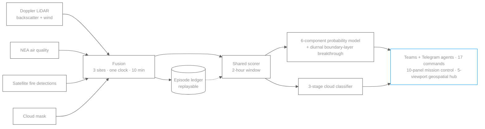

  <picture>
    <source media="(prefers-color-scheme: dark)" srcset="https://raw.githubusercontent.com/awvmeijer/awvmeijer/main/assets/banner-dark.2a213aca.svg">
    <source media="(prefers-color-scheme: light)" srcset="https://raw.githubusercontent.com/awvmeijer/awvmeijer/main/assets/banner-light.9f0d9f94.svg">
    
  </picture>

  <a href="https://anthonymeijer.dev"><b>Portfolio</b></a> &nbsp;·&nbsp;
  <a href="https://www.linkedin.com/in/anthonymeijer">LinkedIn</a> &nbsp;·&nbsp;
  <a href="mailto:awvmeijer@gmail.com">Email</a> &nbsp;·&nbsp;
  <a href="https://orcid.org/0000-0002-6876-6702">ORCID</a>

---

I build and operate production AI end to end: LLM agents with persistent memory and retrieval, real-time sensor-fusion pipelines, and the detection models that decide when to act. I move from deriving a method to running the system in production, and from model internals to a clear explanation for whoever has to trust the output.

For nineteen months I designed, built and operated **3DREAMS@SG** at NTU's Centre for Climate Change and Environmental Health: a real-time haze monitoring platform, with no playbook to inherit. I handed it over in full in August 2026; the centre runs it today, which is the part I am proudest of.

**Available now**, based in Singapore and Southeast Asia · interviewing for AI and systems roles, and taking select fixed-scope builds.

### What I work on

- **LLM agents and RAG** · persistent memory, vector retrieval, knowledge graphs, agent orchestration, human-in-the-loop approval gates
- **Real-time ML systems** · sensor fusion, detection models with calibrated probabilities, event-sourced pipelines, reproducible training
- **Full-stack delivery** · FastAPI and Python backends, Next.js and TypeScript front ends, PostgreSQL and DuckDB, CI and containers

### Selected work

<table>
  <tr>
    <td width="50%" valign="top">
      
    </td>
    <td width="50%" valign="top">
      
    </td>
  </tr>
  <tr>
    <td width="50%" valign="top">
      
    </td>
    <td width="50%"></td>
  </tr>
</table>

| | | |
| --- | --- | --- |
| [**ddp-train-harness**](https://github.com/awvmeijer/ddp-train-harness) | Distributed PyTorch training that reproduces anywhere: CI, torchrun, Docker, multi-node Slurm. | PyTorch DDP · Slurm |
| [**tomorrow-alert-poc**](https://github.com/awvmeijer/tomorrow-alert-poc) | Threshold weather alerts on the Tomorrow.io API: sense, score, act, replay. | FastAPI · Telegram |
| [**Traffic Emissions**](https://anthonymeijer.dev/projects/traffic-emissions.html) | Street-level emissions estimated from traffic cameras that were already there. | Computer vision · MOVES-proxy |
| [**AQ Forecasting**](https://anthonymeijer.dev/projects/aq-forecasting.html) | Six years of Sentinel-5P carbon monoxide, a PyTorch GRU, and an honest account of what it got wrong. | PyTorch · Remote sensing |

> Several of these run as private production systems. Public extracts and full write-ups live in the pinned repositories and on [anthonymeijer.dev](https://anthonymeijer.dev).

### How 3DREAMS@SG works

Four data sources onto one clock, across three sites, on a ten-minute cycle. Every two-hour window runs two detection stages through a single scorer shared by the live pipeline, the replay engine and the dashboard.

### Toolbox

**AI and ML** · Python · PyTorch · scikit-learn · LLM agents · RAG · MCP · knowledge graphs 
**Backend and data** · FastAPI · PostgreSQL · DuckDB · SQLite · PGLite · real-time pipelines 
**Web and visualisation** · Next.js · TypeScript · React · Three.js · Deck.GL · Mapbox 
**Cloud and automation** · Vercel · Azure · Render · GitHub Actions · serverless and cron 
**Scientific** · NumPy · SciPy · Xarray · signal processing · remote sensing · GIS

<i>Open to AI and systems engineering roles. The fullest picture is my <a href="https://anthonymeijer.dev">portfolio</a>.</i>

<!-- Generated by design-system/build/github/readme.mjs in the Portfolio repo. Edit the spec, not this file. -->
