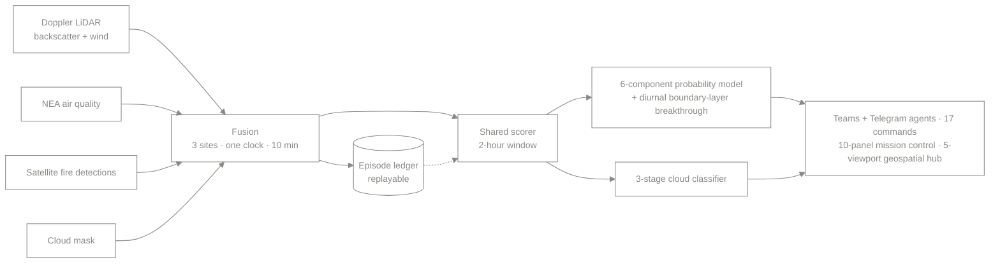

  <picture>
    <source media="(prefers-color-scheme: dark)" srcset="https://raw.githubusercontent.com/awvmeijer/awvmeijer/main/assets/banner-dark.svg">
    <source media="(prefers-color-scheme: light)" srcset="https://raw.githubusercontent.com/awvmeijer/awvmeijer/main/assets/banner-light.svg">
    
  </picture>

  <a href="https://anthonymeijerdev.vercel.app"><code>PORTFOLIO</code></a>
  <a href="https://www.linkedin.com/in/anthonymeijer"><code>LINKEDIN</code></a>
  <a href="mailto:awvmeijer@gmail.com"><code>EMAIL</code></a>

---

I ship production AI end to end: LLM agents with persistent memory and retrieval, real-time sensor-fusion pipelines, and the detection models that decide when to act. I move comfortably from deriving a method to operating the system that runs it in production, and from model internals to a clear explanation for whoever has to trust the output.

Currently building atmospheric-intelligence systems at NTU's Earth Observatory of Singapore.

### What I work on

- **LLM agents &amp; RAG**: persistent memory, vector retrieval, knowledge graphs, agent orchestration, human-in-the-loop approval
- **Real-time ML systems**: sensor fusion, detection models, event-sourced pipelines, reproducible deployments
- **Full-stack delivery**: FastAPI and Python backends, Next.js / TypeScript frontends, PostgreSQL, containers and CI

### How 3DREAMS@SG works

Four data sources onto one clock, across three sites, on a ten-minute cycle. Every two-hour window runs two detection stages through a single scorer shared by the live pipeline, the replay engine, and the dashboard.

### Selected work

| | Project | What it is | Stack |
| --- | --- | --- | --- |
| `01` | **3DREAMS@SG** | Real-time atmospheric-intelligence platform: fuses four data sources across three LiDAR sites, scores transport events, alerts over Teams / Telegram. [Live demo &rarr;](https://3dreams-demo.vercel.app/demo/v5/index.html) | Python &middot; PostgreSQL &middot; Next.js &middot; Three.js |
| `02` | **Brains** | Self-hosted LLM agent platform with episodic memory, a live knowledge graph, and a scheduled agent fleet behind approval gates. | FastAPI &middot; RAG &middot; vector search &middot; d3 |
| `03` | **Forge** | Market-intelligence research system built on Brain memory, with glass-box provenance on every claim. | FastAPI &middot; DuckDB &middot; LLM |

> Several of these run as private production systems. Public, showcase-only versions and write-ups live in the pinned repositories and on my <a href="https://anthonymeijerdev.vercel.app">portfolio</a>.

### Toolbox

`Python` &middot; `PyTorch` &middot; `LLM agents / RAG` &middot; `FastAPI` &middot; `PostgreSQL` &middot; `DuckDB` &middot; `TypeScript` &middot; `Next.js` &middot; `Three.js` &middot; `Docker` &middot; `Vercel / Render / Azure`

<i>Open to AI engineering roles. The best overview is my <a href="https://anthonymeijerdev.vercel.app">portfolio</a>.</i>

